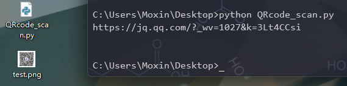

https://blog.easyctf.cn/Moxin/59365.html
# 模块准备

1.pyzbar

`pip install pyzbar`

2.PIL

注意：PIL只支持Python2，所以我们需要安装Pillow

`pip install Pillow`

# 代码示例

```python
from PIL import Image
import pyzbar.pyzbar as pyzbar

def QRcode_message(image):
    img = Image.open(image) # 读取图片
    # 因为一张图片可能是一张二维码，也可能里面有许多二维码
    barcodes = pyzbar.decode(img) # 解析图片信息
    for barcode in barcodes:
    # 如果图片有多个二维吗信息，会自动循环解析
        barcodeData = barcode.data.decode("utf-8")
        print(barcodeData)

if __name__ == '__main__':
    QRcode_message('test.png')
```

演示



